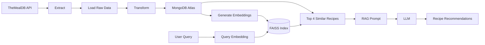

# Recipe Finder

## Project Purpose and Goals

This project brings together the data engineering skills developed during training in a practical, end-to-end application. It goes beyond a basic ETL pipeline by incorporating semantic search and Retrieval-Augmented Generation (RAG).

 

## Dataset 
I chose recipes as the subject because it gave me a dataset that was easy to understand while still providing opportunities to work with messy data, text processing, embeddings and search.

## Goals

- Build an end-to-end ETL pipeline using data from an external API.
- Implement semantic search and RAG to add value to the application.
- Store the data in a cloud database.
- Deploy the application as a working website.

 

  ## Tech Stack

| Technology                  | Purpose                                                              |
| --------------------------- | -------------------------------------------------------------------- |
| **Python**                  | ETL pipeline, data transformation, embeddings and application logic  |
| **TheMealDB API**           | External source for recipe data                                      |
| **MongoDB / MongoDB Atlas** | Database for storing recipe data, with Atlas providing cloud hosting |
| **Sentence Transformers**   | Generate embeddings for recipes and user queries                     |
| **FAISS**                   | Perform semantic similarity searches                                 |
| **LLM / RAG**               | Generate responses based on the recipes retrieved by semantic search |
| **Flask**                   | Connect the backend functionality to the website                     |
| **HTML, CSS & JavaScript**  | Build the frontend                                                   |

 

## Problems & Solutions

###  Overcoming API Limitations

> **The Problem:** Many data sources had strict request limits, which threatened to restrict the size and scope of the dataset.
> 
> **The Solution:** A shift to **TheMealDB** bypassed these restrictive request limitations, making it possible to successfully scale up and collect a much larger amount of data.

###  Choosing an LLM

> **The Problem:** The LLMs initially tested suffered from request limits or frequently became overloaded, impacting performance.
> 
> **The Solution:** Transitioning to a free, more basic model combined with refined prompting allowed for much more consistent and reliable responses.

###  Deploying the Application

> **The Problem:** The application initially experienced connectivity issues with MongoDB Atlas upon deployment, caused by hosting and connection configuration errors.
> 
> **The Solution:** Investigating the configuration revealed that modifying the prefix of the API connection string resolved the issue and established a stable connection.

## Finished Product

The finished application allows users to search for recipes using natural language. Semantic search retrieves recipes based on the meaning of the user's query, and RAG uses the retrieved recipes to generate a relevant response.

The application displays the recommended recipes along with their ingredients and cooking instructions, with the recipe data stored in MongoDB Atlas and the application deployed using Flask.

## Why This Is Useful for Companies

- Demonstrates an understanding of the end-to-end data lifecycle, from extracting data through to using it in an application.
- Shows how raw data can be transformed into a usable and structured format.
- Demonstrates experience working with cloud-hosted databases and deployed applications.
- Shows how semantic search and AI can be applied to data to create useful functionality for end users.
- Demonstrates the ability to troubleshoot problems and work around technical limitations.
- Shows that these skills can be applied to different datasets and business requirements, rather than being limited to recipe data.

## 📋 Future Improvements

| Improvement | Description |
| :--- | :--- |
| **ETL Pipeline** | Automate the ETL pipeline so that new recipes added to the API are automatically extracted, transformed and loaded into the database. |
| **Embeddings & FAISS** | Automatically generate embeddings for newly added recipes and update the FAISS index so they can be included in semantic searches. |
| **LLM Integration** | Improve the LLM integration by testing more capable models and refining the RAG process. |
| **Search Experience** | Improve the search experience by adding filters such as cuisine, category and ingredients. |

  
